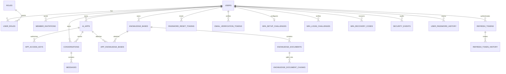

# KnowledgeHub 数据库设计

## 设计范围

第一阶段只使用 PostgreSQL，负责用户、权限、AI 应用、知识库、会话和消息数据。
Redis 与 MongoDB 将在出现明确的缓存、限流或大规模非结构化数据需求后引入。

## 实体关系

## 关键决策

- 全部业务主键使用 UUID，避免暴露连续编号，也便于未来分布式写入。
- 邮箱在写入前必须转为小写，并通过表达式唯一索引保证账号唯一。
- 用户与角色、应用与知识库均使用关联表表达多对多关系。
- 空工作区的首个活跃账号获得 `admin` 角色，后续注册默认为 `member`；升级迁移会在缺少活跃管理员时提升最早的活跃账号。首账号判定和管理员变更使用 PostgreSQL 事务级咨询锁串行化，避免并发造成无管理员或重复引导管理员。
- 管理员接口每次从 `user_roles` 实时检查权限，不只信任访问令牌中的旧角色声明。角色或账号状态变化会撤销目标账号全部设备会话并写入安全事件；禁止修改自己的角色/状态，并始终保留至少一位启用中的管理员。
- `member_invitations` 保存规范化邮箱、目标角色、邀请人、发送/接受/撤销时间与一次性令牌的 SHA-256 哈希。邀请创建、重发、接受和普通注册使用同一规范化邮箱的事务级咨询锁；普通注册会撤销该邮箱的未完成邀请。新邀请和重发会作废旧令牌；接受时继续锁定邀请行、验证强密码并在一个事务内创建已验证账号、角色和密码历史，因此并发接受只有一个请求成功。
- 邀请邮件发送成功前链接不能被接受；SMTP 失败会将对应邀请立即撤销。邀请明文只进入邮件链接和接受请求正文，不写入数据库、API 响应或应用日志。
- `app_knowledge_bases.owner_id` 配合复合外键，保证应用不能绑定其他所有者的知识库。
- `knowledge_documents` 通过 `(knowledge_base_id, owner_id)` 复合外键继承知识库所有权，并记录来源、解析状态、分块数和 FastGPT Collection ID。
- `knowledge_document_chunks` 保存有序正文和检索元数据；复合外键继续传递所有权，唯一位置约束保证文档内顺序，触发器自动同步文档分块数。
- PostgreSQL `pg_trgm` 为分块正文提供中文短词、子串和近似文本检索能力；知识库检索只读取状态为 `ready` 的文档并按相关度稳定排序。
- 文档正文导入在锁定所属文档后事务性替换全部分块，同时更新 MIME 类型、字节数、SHA-256、处理状态和错误信息；任一步失败都会保留原有内容。
- 消息使用 `(conversation_id, sequence_no)` 唯一约束维持会话内顺序。
- FastGPT 生成在会话行锁下检查进行中任务，并在一个事务内写入用户消息和 `pending` 助手消息；部分唯一索引保证每个对话最多只有一条待生成助手消息，再原位更新为 `completed` 或 `failed`。
- 最新失败助手消息可原位重试，不新增重复用户消息；`metadata` 保存重试次数、历史错误码和重试时间，继续维持原序号审计链路。
- FastGPT API Key 是平台访问上游服务的凭据，只保存 AES-256-GCM 密文，应用层不得返回明文。
- `app_access_keys` 是外部系统访问单个应用的独立凭据，通过 `(app_id, owner_id)` 复合外键继承应用所有权。密钥明文只在创建响应出现一次；数据库仅保存 SHA-256 哈希、固定前缀、有效期、撤销时间和最近使用时间。外部请求必须同时满足密钥有效、账号启用且邮箱已验证、应用启用及 FastGPT 凭据已配置，并且只能继续同一应用的活跃对话。
- 刷新令牌行同时作为稳定设备会话：轮换时原位替换令牌哈希并更新最近活动时间，不为同一设备制造重复会话；访问令牌携带会话 ID，支持识别和单独撤销当前设备。
- `refresh_token_history` 只保存已轮换令牌的 SHA-256 哈希、所属会话和原到期时间。命中未过期历史哈希会在同一事务中撤销该设备当前会话并记录失败安全事件；过期历史在正常轮换时清理，令牌明文始终不落库。
- `password_reset_tokens` 保存一次性随机令牌的 SHA-256 哈希、用户、到期/消费时间和请求 IP；同一用户的新请求会作废旧链接。确认重置按用户行、令牌行的固定顺序加锁，并在一个事务内执行密码历史写入、全部链接消费、登录锁定清零、设备会话撤销和安全事件记录。
- `users.email_verified_at` 是登录邮箱是否完成验证的授权边界；迁移会回填历史账号，新注册账号保持为空且不能创建任何设备会话。`email_verification_tokens` 只保存一次性随机令牌的 SHA-256 哈希、到期/消费时间和请求 IP，新请求会原子作废旧链接，并发确认只有一个事务可以成功。
- `users.mfa_secret_ciphertext` 只保存 AES-256-GCM 密文，并通过状态约束确保密钥和启用时间同时存在或同时为空；待确认密钥独立保存在有期限的 `mfa_setup_challenges` 中。
- `mfa_login_challenges` 只保存登录挑战的 SHA-256 哈希，记录五分钟有效期、失败次数和一次性消费时间；密码阶段不创建刷新会话，验证器或恢复码成功后才签发设备会话。
- `mfa_recovery_codes` 只保存规范化恢复码的 SHA-256 哈希和使用时间。使用恢复码、替换全部恢复码和关闭 MFA 均在用户行锁保护的事务中完成，防止并发重复消费。
- 设备会话记录用户代理、API 观察到的来源 IP、登录时间、最近活动与到期时间；这些字段只用于安全审计和用户主动退出设备，不参与授权决策。
- 每个受保护请求都使用访问令牌中的会话 ID 查询 `refresh_tokens` 的所有者、撤销和到期状态；这使退出、改密和会话撤销能立即阻断旧访问令牌，不再等待 JWT 自然过期。
- 认证中间件对每个会话最多每分钟回写一次 `last_used_at`，在设备活动准确度与数据库写放大之间取得平衡。
- `security_events` 保存账号安全活动的不可变快照：事件类型、结果、来源设备/IP、执行会话、目标会话、受控元数据和发生时间；会话 ID 按值保留以避免日志随会话清理而丢失。全局时间、事件类型和失败事件索引支持管理员审计查询；CSV 导出自身也记录为审计事件，但只保留筛选是否存在、导出行数和截断状态。
- 个人安全事件查询始终以 `user_id` 限定所有者；只有经过实时角色校验的管理员接口可以读取跨账号时间线，并从执行会话或受控的管理员 ID 元数据解析操作人。密码、令牌、API Key、MFA 密钥与验证码和请求正文不进入审计元数据。
- `users.failed_login_attempts`、`last_failed_login_at` 和 `locked_until` 组成账号级异常登录保护；登录事务使用行锁串行化同一账号的并发尝试，避免竞态条件绕过锁定阈值。
- 失败窗口外的旧计数自动失效，锁定期结束后在下一次登录尝试中事务性解锁；成功登录和修改密码均会清零失败状态。
- `user_password_history` 按用户保存有序 bcrypt 哈希，迁移时以当前密码哈希回填已有账号，注册时写入首条记录。修改密码在用户行锁和同一事务内完成历史比对、新哈希写入、超额记录清理与全会话撤销；默认保留最新 5 条，可配置为 2-10 条，绝不保存明文密码。
- JSONB 只承载可变扩展字段，核心关系仍使用普通列和外键表达。
- 删除用户、应用等核心数据默认受限，避免级联误删；会话删除时才级联删除消息。

## 后续演进

- 第二阶段加入数据库迁移工具，建表脚本不再直接承担版本升级。
- 需要多租户协作时，将当前单工作区 `admin/member` 角色扩展为组织、组织成员和资源权限表。
- 出现热点读取后加入 Redis，并用性能数据证明缓存收益。
- 对话量达到 PostgreSQL 运维瓶颈后，再评估将消息迁移到 MongoDB。
